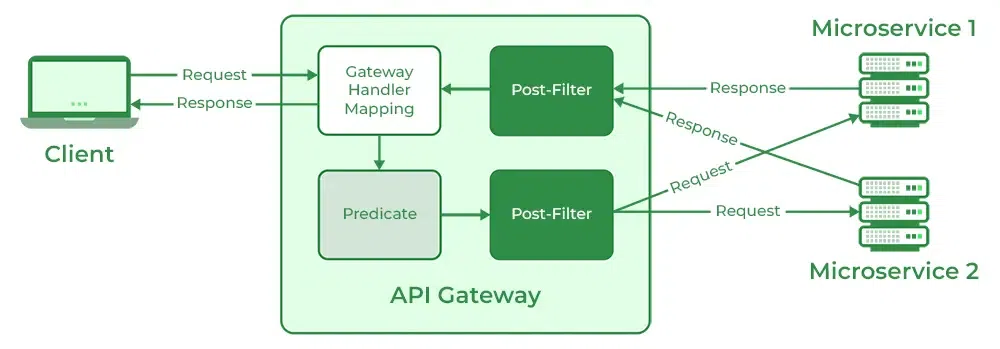
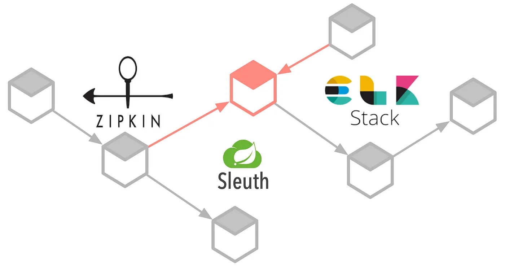

# Plateforme de blogs touristiques

This project is a tourism blog application where each user can add a blog and access all blogs. The application uses a microservices architecture for better scalability and maintainability. The main components of the application are developed using Spring Boot for the backend and Angular for the frontend.

**Frameworks used:**
- <span> Backend: Spring Boot 3.2.4  , Maven , Java 17  </san>
- <span> Frontend: Angular 16.1.2 </span>

<span> **Server:** Apache web server </span>

<span> **Database:** PostgreSQL </span>

**Additional tools:**

-  **Docker**: for containerizing the services.

-  **Postman**: For backend Http requests test.

## Diagrams

#### Global architechture

 

## Content

- [0. Setting Up Microservices](#0-setting-up-microservices)
    - [1. Overview](#1-setup-the-frontend-application)
    - [2. Prequeries](#2-app-layout)
- [1. Postgres & PGAdmin on docker](#1-postgres-&-pgadmin-on-docker)
- [2. Create new microservices](#2-mvc-design-pattern)
- [3. Communication between microservices using restTemplate](#2-file-system)
- [4. Service Discovery using Eureka](#1-database-connexion--configuration)
- [5. Spring Cloud Gateway](#2-setup-frontend-application)
    - [1. Setup the frontend application](#1-setup-the-frontend-application)
    - [2. App layout](#2-app-layout)
    - [3. Views](#2-views)

## 0. Setting Up Microservices

### 1. Overview
In this section, we will set up the initial structure for our microservices. 

This project consists of multiple microservices : **blog**, **user**, **comments** that communicate with each other via REST APIs. The microservices include:

### 2. Prequeries

Before you begin, ensure you have the following installed on your machine:

- Java Development Kit (JDK) 11 or later
- Apache Maven 3.6.0 or later
- Docker (for running databases and other services)


## 1. Postgres & PGAdmin on docker
- Configure docker-compose file by adding Postgres and PGAdmin (GUI) images.
- Connecting to DB using PGAdmin

## 2. Create new microservices
Create new microservices: blog, user and comments.

- **Blog** : The Blog Service is responsible for managing blog-related operations. This includes creating, reading and updating blog posts. Each blog post contains information such as the destination, title, details and images.

- **User** : The User Service handles user-related operations, including user registration, authentication, and profile management. This service is crucial for managing the users who can create and comment on blog posts.

- **Comments** : The Comments Service is responsible for managing comments on blog posts. Users can add comments to blog posts, which can then be retrieved or updated. Each comment is associated with a specific blog post and user.


## 3. Communication between microservices using restTemplate

After creating all microservices, we're supposed to send requests (Http requests) between them via restTemplate to get data from other microservices.

1. Make a configuration file for restTemplate
2. Add restTemplate in the service class using dependency injection
3. Call the microservice using restTemplate

```bash
ResponseEntity<user> response = restTemplate.getForEntity("http://gateway:8222/users/getuser/{userId}", user.class, userId);
        if (response.getStatusCode().is2xxSuccessful()) {
            return response.getBody();
        } else {
            // Gérer les erreurs
            return null;
        }
```

## 4. Service Discovery using Eureka

#### 1. Quick summary
#### What is Service Discovery?
In a microservices architecture, each microservice is a standalone application with specific business functionality. Since these microservices need to communicate with each other to function as a complete application, they need to know each other’s network locations. Service Discovery comes into play here, maintaining a record of these services’ locations, helping them find each other, and enabling communication.

#### What is Spring Cloud Eureka?
Spring Cloud Eureka, part of the Spring Cloud Netflix project, is a service registry that allows microservices to register themselves and discover other services. In essence, it acts like a phone directory for your microservices, providing a mechanism for service-to-service discovery and registration.

#### 2. Architecture
Steps :
- microservices register to eureka server.
- look up the service using eureka server.
- eureka server will return the service information.

  

#### 3. How do I get set up?

In order to transform a common Spring Boot application into an Eureka Server, only three steps are needed:

- Add Spring Cloud dependency:
```bash
<dependency>
    <groupId>org.springframework.cloud</groupId>
    <artifactId>spring-cloud-starter-netflix-eureka-server</artifactId>
</dependency>
```

- Enable Eureka initialization during Spring Boot startup using the annotation @EnableEurekaServer on the main class:
```bash
@SpringBootApplication
@EnableEurekaServer
public class EurekaServerApplication {
    public static void main(String[] args) {
        SpringApplication.run(EurekaServerApplication.class, args);
    }
}
```

- Add some configuration : 

*application.yml*

```bash
spring:
  application:
    name: discovery

eureka:
  instance:
    hostname: discovery
  client:
    register-with-eureka: false
    fetch-registry: false
    service-url:
      defaultZone: http://discovery:8761/eureka/
server:
  port: 8761
```
- Enable eureka in microservices
```bash
@SpringBootApplication
@EnableEurekaClient
public class ExampleMicroserviceApplication {
    public static void main(String[] args) {
        SpringApplication.run(ExampleMicroserviceApplication.class, args);
    }
}
```

## 5. Spring Cloud Gateway
API gateway acts as a single point of entry for a collection of microservices. In simple words, all microservices can be accessed through a single port or route. It is a non-blocking and reactive gateway that provides several features like routing, filtering, load balancing, circuit breaking, and more. 

### 1. Architecture


- The process begins with the client sending a request to the API gateway. 
- The request first goes to the Gateway mapping handler. It uses Predicate to check whether a request matches a route. 
- The request is then transferred to Gateway Web Handler. It passes the request through the Filter Chain specific to the request. 
- Here the filters can be considered in two categories. 
- When requests arrive all the pre-filter logic is executed. After the request is made all the post-filter logic is executed.

### 2. Setup Spring Cloud Gateway
- Add maven dependency for Spring Cloud Gateway in pom.xml :

```bash
<dependency>
    <groupId>org.springframework.cloud</groupId>
    <artifactId>spring-cloud-starter-gateway</artifactId>
</dependency>
```

## 6. Distributed Tracing Sleuth & Zipkin


### 1. What is Distributed Tracing?
Distributed tracing is a method used to monitor applications, especially those built using a microservices architecture. Each microservice contributes a small amount to the overall functionality, and it’s beneficial to trace how requests pass through these services.

### 2. How do they work together?
Spring Cloud Sleuth generates traces and spans. Traces represent a whole unit of work, while spans represent an individual unit of work done in a trace. Zipkin then visualizes this data.

### 3. Setting up Spring Cloud Sleuth
Add the Spring Cloud Sleuth starter to your `pom.xml`:

```bash
<dependency>
    <groupId>org.springframework.cloud</groupId>
    <artifactId>spring-cloud-starter-sleuth</artifactId>
</dependency>
```

- Once starting application, Sleuth will add trace and span ids to your logs.

### 4. Integrating with Zipkin
To send these logs to Zipkin, add the Zipkin starter in `pom.xml`:

```bash 
<dependency>
    <groupId>org.springframework.cloud</groupId>
    <artifactId>spring-cloud-starter-zipkin</artifactId>
</dependency>
```
