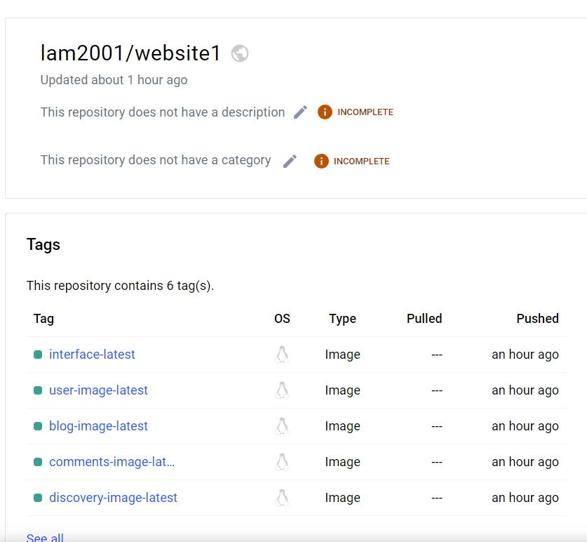
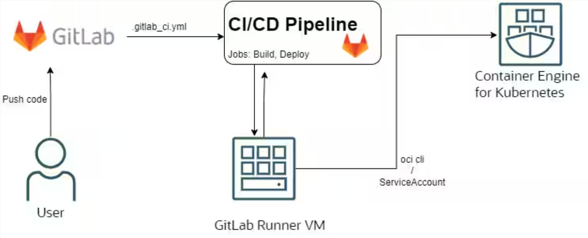
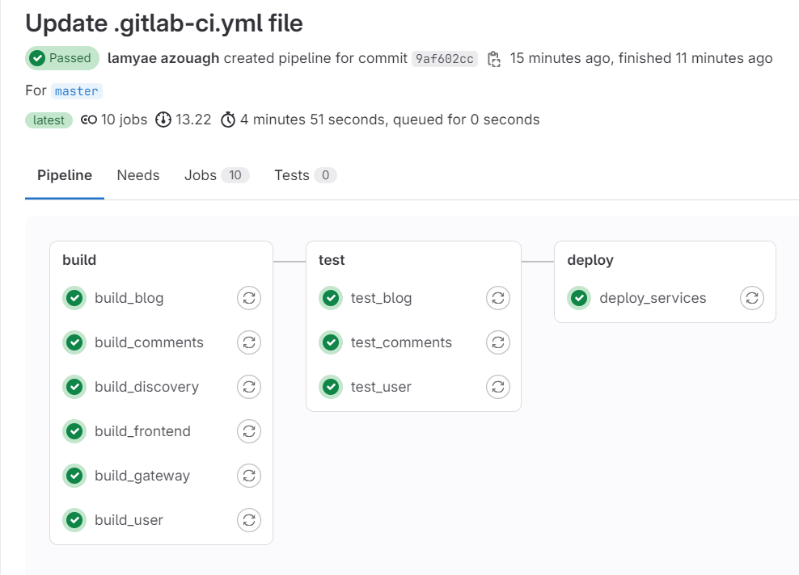

# Plateforme de blogs touristiques

This project is a tourism blog application where each user can add a blog and access all blogs. The application uses a microservices architecture for better scalability and maintainability. The main components of the application are developed using Spring Boot for the backend and Angular for the frontend. The application is bilingual, leveraging the Google Cloud Translator API to provide content in multiple languages in a generic way. Additionally, it integrates the Google Maps API to access and display the exact location of each blog post.

### Overview

[](assets/interfaces/Mobile%20App%20Presentation%20_%20Video%20Template.mp4)

**Frameworks used:**

- <span> Backend: Spring Boot 3.2.4  , Maven , Java 17 </san>
- <span> Frontend: Angular 16.1.2 </span>

<span> **Server:** Apache web server </span>

<span> **Database:** PostgreSQL </span>

**Additional tools:**

-  **Docker**: for containerizing the services.

-  **Postman**: For backend Http requests test.

## Diagrams

#### Use case


#### Global architechture


## Content

- [0. Setting Up Microservices](#0-setting-up-microservices)
  - [1. Overview](#1-overview)
  - [2. Prequeries](#2-prequeries)
- [1. Postgres & PGAdmin on docker](#1-postgres-pgadmin-on-docker)
- [2. Create new microservices](#2-create-new-microservices)
- [3. Communication between microservices using restTemplate](#3-communication-between-microservices-using-restTemplate)
- [4. Service Discovery using Eureka](#4-service-discovery-using-eureka)
  - [1. Quick summary](#1-quick-summary)
  - [2. Architecture](#2-architecture)
  - [3. How do I get set up?](#3-how-do-i-get-set-up)
- [5. Spring Cloud Gateway](#5-spring-cloud-gateway)
  - [1. Architecture](#1-architecture)
  - [2. Setup Spring Cloud Gateway](#2-setup-spring-cloud-gateway)
  - [3. Views](#2-views)
- [6. Distributed Tracing Sleuth & Zipkin](#6-distributed-tracing-sleuth--zipkin)
  - [1. What is Distributed Tracing?](#1-what-is-distributed-tracing)
  - [2. How do they work together?](#2-how-do-they-work-together)
  - [3. Setting up Spring Cloud Sleuth](#3-setting-up-spring-cloud-sleuth)
  - [4. Integrating with Zipkin](#4-integrating-with-zipkin)
- [7. Containerizing microservices using Docker](#7-containerizing-microservices-using-docker)
  - [1. Docker — Overview](#1-docker--overview)
  - [2. Set Up](#2-set-up)
- [8. Deploy microservices to local Kubernetes](#8-deploy-microservices-to-local-kubernetes)
- [9. Deploy with Gitlab](#9-deploy-with-gitlab)
  <<<<<<< HEAD

=======

- [10. Maps functionality](#10-maps-functionality)

> > > > > > > 3760f1e67752fa6e1569fa2fa09e3c671fd24c8c

## 0. Setting Up Microservices

### 1. Overview

In this section, we will set up the initial structure for our microservices.

This project consists of multiple microservices : **blog**, **user**, **comments** that communicate with each other via REST APIs. The microservices include:

### 2. Prequeries

Before you begin, ensure you have the following installed on your machine:

- Java Development Kit (JDK) 11 or later
- Apache Maven 3.6.0 or later
- Docker (for running databases and other services)

## 1. Postgres & PGAdmin on docker

- Configure docker-compose file by adding Postgres and PGAdmin (GUI) images.
- Connecting to DB using PGAdmin

## 2. Create new microservices

Create new microservices: blog, user and comments.

- **Blog** : The Blog Service is responsible for managing blog-related operations. This includes creating and reading blog posts. Each blog post contains information such as the destination, title, details, location and images.

- **User** : The User Service handles user-related operations, including user registration, authentication, and profile management. This service is crucial for managing the users who can create and comment on blog posts.

- **Comments** : The Comments Service is responsible for managing comments on blog posts. Users can add comments to blog posts, which can then be retrieved. Each comment is associated with a specific blog post and user.

## 3. Communication between microservices using restTemplate

After creating all microservices, we're supposed to send requests (Http requests) between them via restTemplate to get data from other microservices.

1. Make a configuration file for restTemplate
2. Add restTemplate in the service class using dependency injection
3. Call the microservice using restTemplate

```bash
ResponseEntity<user> response = restTemplate.getForEntity("http://gateway:8222/users/getuser/{userId}", user.class, userId);
        if (response.getStatusCode().is2xxSuccessful()) {
            return response.getBody();
        } else {
            // Gérer les erreurs
            return null;
        }
```

## 4. Service Discovery using Eureka

### 1. Quick summary

#### What is Service Discovery?

In a microservices architecture, each microservice is a standalone application with specific business functionality. Since these microservices need to communicate with each other to function as a complete application, they need to know each other’s network locations. Service Discovery comes into play here, maintaining a record of these services’ locations, helping them find each other, and enabling communication.

#### What is Spring Cloud Eureka?

Spring Cloud Eureka, part of the Spring Cloud Netflix project, is a service registry that allows microservices to register themselves and discover other services. In essence, it acts like a phone directory for your microservices, providing a mechanism for service-to-service discovery and registration.

### 2. Architecture

Steps :

- microservices register to eureka server.
- look up the service using eureka server.
- eureka server will return the service information.


### 3. How do I get set up?

In order to transform a common Spring Boot application into an Eureka Server, only three steps are needed:

- Add Spring Cloud dependency:

```bash
<dependency>
    <groupId>org.springframework.cloud</groupId>
    <artifactId>spring-cloud-starter-netflix-eureka-server</artifactId>
</dependency>
```

- Enable Eureka initialization during Spring Boot startup using the annotation @EnableEurekaServer on the main class:

```bash
@SpringBootApplication
@EnableEurekaServer
public class EurekaServerApplication {
    public static void main(String[] args) {
        SpringApplication.run(EurekaServerApplication.class, args);
    }
}
```

- Add some configuration :

_application.yml_

```bash
spring:
  application:
    name: discovery

eureka:
  instance:
    hostname: discovery
  client:
    register-with-eureka: false
    fetch-registry: false
    service-url:
      defaultZone: http://discovery:8761/eureka/
server:
  port: 8761
```

- Enable eureka in microservices

```bash
@SpringBootApplication
@EnableEurekaClient
public class ExampleMicroserviceApplication {
    public static void main(String[] args) {
        SpringApplication.run(ExampleMicroserviceApplication.class, args);
    }
}
```

## 5. Spring Cloud Gateway

API gateway acts as a single point of entry for a collection of microservices. In simple words, all microservices can be accessed through a single port or route. It is a non-blocking and reactive gateway that provides several features like routing, filtering, load balancing, circuit breaking, and more.

### 1. Architecture


- The process begins with the client sending a request to the API gateway.
- The request first goes to the Gateway mapping handler. It uses Predicate to check whether a request matches a route.
- The request is then transferred to Gateway Web Handler. It passes the request through the Filter Chain specific to the request.
- Here the filters can be considered in two categories.
- When requests arrive all the pre-filter logic is executed. After the request is made all the post-filter logic is executed.

### 2. Setup Spring Cloud Gateway

- Add maven dependency for Spring Cloud Gateway in pom.xml :

```bash
<dependency>
    <groupId>org.springframework.cloud</groupId>
    <artifactId>spring-cloud-starter-gateway</artifactId>
</dependency>
```

## 6. Distributed Tracing Sleuth & Zipkin


### 1. What is Distributed Tracing?

Distributed tracing is a method used to monitor applications, especially those built using a microservices architecture. Each microservice contributes a small amount to the overall functionality, and it’s beneficial to trace how requests pass through these services.

### 2. How do they work together?

Spring Cloud Sleuth generates traces and spans. Traces represent a whole unit of work, while spans represent an individual unit of work done in a trace. Zipkin then visualizes this data.

### 3. Setting up Spring Cloud Sleuth

Add the Spring Cloud Sleuth starter to your `pom.xml`:

```bash
<dependency>
    <groupId>org.springframework.cloud</groupId>
    <artifactId>spring-cloud-starter-sleuth</artifactId>
</dependency>
```

- Once starting application, Sleuth will add trace and span ids to your logs.

### 4. Integrating with Zipkin

To send these logs to Zipkin, add the Zipkin starter in `pom.xml`:

```bash
<dependency>
    <groupId>org.springframework.cloud</groupId>
    <artifactId>spring-cloud-starter-zipkin</artifactId>
</dependency>
```

## 7. Containerizing microservices using Docker

### 1. Docker — Overview

Docker is a **containerization technology** that allows developers to package an application along with all its dependencies into a container. These containers are lightweight, portable, and can run on any platform that supports Docker. A docker container simplifies the process of building, shipping, and running applications, making it easier to manage and scale them.

#### Four Major Components of Docker

- **Container:** A container is a standalone executable package that includes an application and all its dependencies.

- **Image:** An image is a read-only template that defines the contents and configuration of a container.

- **Docker Engine:** The Docker Engine is the core component responsible for building, running, and managing containers.

- **Registry:** Docker images can be stored and shared in registries, which act as centralized repositories.

### 2. Set Up

```bash
blog:
    image: lam2001/website1:blog-image-latest
    container_name: blog
    ports:
      - "9097:9097"
    environment:
      - SPRING_DATASOURCE_URL=jdbc:postgresql://postgres:5432/blogs
      - SPRING_DATASOURCE_USERNAME=postgres
      - SPRING_DATASOURCE_PASSWORD=2001195
      - SPRING_ZIPKIN_BASE_URL=http://zipkin:9411
      - SPRING_SLEUTH_SAMPLER_PROBABILITY=1.0
      - KAFKA_BOOTSTRAP_SERVERS=kafka:9092
    networks:
      - mynetwork
```



## 8. Deploy microservices to Kubernetes

### 1. What is Kubernetes ?

Kubernetes (also known as k8s or “kube”) is an open source container orchestration platform that automates many of the manual processes involved in deploying, managing, and scaling containerized applications.

### 2. Setting up

- For Google cloud, you need to tag your local docker image using correct location, project and repository names as shown below.

```bash
docker tag SOURCE-IMAGE LOCATION-docker.pkg.dev/PROJECT-ID/REPOSITORY/IMAGE
Example: docker tag my-image us-east1-docker.pkg.dev/my-project/my-repo/test-image
```

- Push the tagged docker image into Google artifactory

```bash
docker push LOCATION-docker.pkg.dev/PROJECT-ID/REPOSITORY/IMAGE:TAG
```

- Deploy your docker containers into GKE (Google Kubernetes Engine)

```bash
apiVersion: apps/v1
kind: Deployment
metadata:
  name: blog
spec:
  replicas: 1
  selector:
    matchLabels:
      app: blog
  template:
    metadata:
      labels:
        app: blog
    spec:
      containers:
        - name: blog
          image: lam2001/website1:blog-image-latest
          ports:
            - containerPort: 9097
          env:
            - name: SPRING_DATASOURCE_URL
              value: jdbc:postgresql://postgres:5432/blogs
            - name: SPRING_DATASOURCE_USERNAME
              value: "postgres"
            - name: SPRING_DATASOURCE_PASSWORD
              value: "2001195"

```

## 9. Deploy with Gitlab

We started by manually pushing our code into Gitlab. This is the intended pipeline we're aiming to achieve:


In the GitLab pipeline, we build and push Docker images for various services to Docker Hub. The services are then tested using Maven and finally deployed to a Kubernetes cluster using Google Cloud SDK. The deployment applies Kubernetes deployment configurations for each service



## 10. Maps functionality

To integrate google maps into our project:

1. We generated the maps API key from google cloud and included it in the project
2. Install the library in Angular:

```
npm install angular@google-maps
```

With that, each blog is associated to a specific location on the map that we can visualize.

## 11.Translation Functionality

The tourism blog application supports multilingual content, ensuring accessibility for users who speak different languages. The translation functionality is implemented as follows:

### Static Elements:

For static elements of the website (such as navigation menus, labels, and other fixed text), we use the Angular translation library @ngx-translate/core. This library allows us to manage translations through JSON files (en.json and fr.json) for each supported language.
These JSON files contain key-value pairs where keys are identifiers used in the code, and values are the corresponding translations in different languages.

### Dynamic Content:

For dynamic content such as blog posts and user comments, we use the Google Cloud Translator API. This allows real-time translation of user-generated content.
When a user submits a blog post or comment, the content is sent to the Google Cloud Translator API, which returns the translated text.

The translated content is then displayed on the website, providing a seamless multilingual experience for all users.
